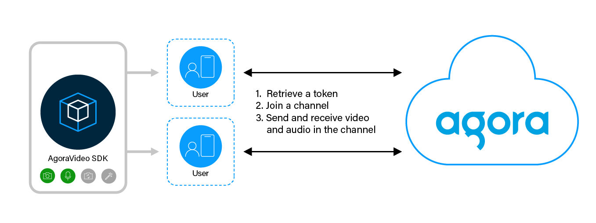

# SDK quickstart

Video Calling enables one-to-one or small-group video chat connections with smooth, jitter-free streaming video. Agora’s Video SDK makes it easy to embed real-time video chat into web, mobile and native apps.

Thanks to Agora’s intelligent and global Software Defined Real-time Network ([Agora SD-RTN™](https://docs.agora.io/en/video-calling/overview/core-concepts#agora-sd-rtn)), you can rely on the highest available video and audio quality.

This page shows the minimum code you need to integrate high-quality, low-latency Video Calling features into your app using Video SDK.

## Understand the tech

This section explains how you can integrate Video Calling features into your app. The following figure shows the workflow you need to integrate this feature into your app.



To start a session, implement the following steps in your app:

- *Retrieve a token*: A token is a computer-generated string that authenticates a user when your app joins a channel. In this guide you retrieve your token from Agora Console. To see how to create an authentication server for development purposes, see [Implement the authentication workflow](https://docs.agora.io/en/video-calling/develop/authentication-workflow). To develop your own token generator and integrate it into your production IAM system, read [Token generators](https://docs.agora.io/en//video-calling/develop/integrate-token-generation).

- *Join a channel*: Call methods to create and join a channel; apps that pass the same channel name join the same channel.

- *Send and receive video and audio in the channel*: All users send and receive video and audio streams from all users in the channel.


## Prerequisites

In order to run the SDK quickstart sample project, you must have

* Installed [Git](https://git-scm.com/downloads)
- [Android Studio](https://developer.android.com/studio) 4.1 or higher.
- Android SDK API Level 24 or higher.
- A mobile device that runs Android 4.1 or higher.

- An Agora [account](https://docs.agora.io/en/video-calling/reference/manage-agora-account#create-an-agora-account) and [project](https://docs.agora.io/en/video-calling/reference/manage-agora-account#create-an-agora-project).
- A computer with Internet access.

    Ensure that no firewall is blocking your network communication.

## Project setup

To run the SDK quickstart sample project, take the following steps:

1. Clone the [Video SDK samples Git repository](https://github.com/AgoraIO/video-sdk-samples-android) to your development machine by executing the following command in a terminal window:

    ```bash
    git clone https://github.com/AgoraIO/video-sdk-samples-android.git
    ```

1. Launch Android Studio. To open the sample project, select **Open...** from the **File** menu and navigate to the `sdk_quickstart` folder under `video-sdk-samples-android/Docs-Examples/`. Wait for Android Studio to load the project and the Gradle sync process to finish downloading the dependencies.

1. Connect an Android device to your development device.

1. In Android Studio, click **Run app**. A moment later, you see the app installed and running on your device.

## Implement a client for Video Calling

When a user opens the app, you initialize Agora Engine. When the user taps a button, the app joins or leaves a channel. When another user joins the same channel, their video and audio is rendered in the app. This simple workflow demonstrates the core Agora features without the UX bells and whistles.


The following figure shows the API call sequence of implementing  Video Calling.


This section features essential code snippets from the call quality sample project, to demonstrate how you can implement the basic Video Calling API call sequence in your own project. 

Open the file `agora_helper/java/com/example/agora_helper/AgoraManager.java`. This file defines the `AgoraManager` class that encapsulates the `RTCEngine` instance and its core functionality. Inspect the following key code snippets in this file:

1. **Import Video SDK classes and interfaces**

    The following lines `import` the necessary Video SDK classes and interfaces into the project:

    ``` java
    import io.agora.rtc2.RtcEngine;
    import io.agora.rtc2.RtcEngineConfig;
    import io.agora.rtc2.Constants;
    import io.agora.rtc2.IRtcEngineEventHandler;
    import io.agora.rtc2.video.VideoCanvas;
    import io.agora.rtc2.ChannelMediaOptions;
    ```

2.  **Variables to create and join a channel**

    The `AgoraManager` class declares the following variables to manage Video Calling:

    ``` java
    // The reference to the Android activity you use for video calling
    protected final Activity activity;
    protected final Context mContext;
    // The RTCEngine instance
    protected RtcEngine agoraEngine;
    // The event handler for agoraEngine events
    protected AgoraManagerListener mListener;
    // Your App ID from Agora console
    protected final String appId;
    // The name of the channel to join
    protected String channelName;
    // UIDs of the local and remote users
    protected int localUid = 0, remoteUid = 0;
    // Status of the video call
    protected boolean joined = false;
    // Reference to FrameLayouts in your UI for rendering local and remote videos
    protected FrameLayout localFrameLayout, remoteFrameLayout;
    //SurfaceView to render local video in a Container.
    protected SurfaceView localSurfaceView;
    //SurfaceView to render Remote video in a Container.
    protected SurfaceView remoteSurfaceView;
    ```

3.  **Setup  Agora Engine**

    To implement Video Calling, you use Video SDK to create an  Agora Engine instance. The following code in the `AgoraManager` class, uses the application context, and the app ID to create an instance named `agoraEngine` and sets up an event handler for it.

    ``` java
    protected boolean setupVideoSDKEngine() {
        try {
            RtcEngineConfig config = new RtcEngineConfig();
            config.mContext = mContext;
            config.mAppId = appId;
            config.mEventHandler = getIRtcEngineEventHandler();
            agoraEngine = RtcEngine.create(config);
            // By default, the video module is disabled, call enableVideo to enable it.
            agoraEngine.enableVideo();
        } catch (Exception e) {
            sendMessage(e.toString());
            return false;
        }
        return true;
    }
    ```

4.  **Handle and respond to  Agora Engine events**

    The following method in the `AgoraManager` class, sets up and returns the Agora Engine event handler:

    ``` java
    protected IRtcEngineEventHandler getIRtcEngineEventHandler() {

        return new IRtcEngineEventHandler() {
            @Override
            // Listen for a remote user joining the channel.
            public void onUserJoined(int uid, int elapsed) {
                sendMessage("Remote user joined " + uid);
                // Save the uid of the remote user.
                remoteUid = uid;

                // Set the remote video view for the new user.
                setupRemoteVideo();
            }

            @Override
            public void onJoinChannelSuccess(String channel, int uid, int elapsed) {
                // Set joined status to true.
                joined = true;
                sendMessage("Joined Channel " + channel);
                // Save the uid of the local user.
                localUid = uid;
            }

            @Override
            public void onUserOffline(int uid, int reason) {
                sendMessage("Remote user offline " + uid + " " + reason);
                activity.runOnUiThread(() -> remoteSurfaceView.setVisibility(View.GONE));
            }
        };
    }
    ```

5.  **Render video from a remote user in the channel**

    When a remote user subscribes to the channel you display their video stream in the interface using the following `setupRemoteVideo` method:

    ``` java
    protected void setupRemoteVideo () {
        // Run code on the UI thread as the code modifies the UI
        activity.runOnUiThread(() -> {
            // Create a new SurfaceView
            remoteSurfaceView = new SurfaceView(mContext);
            remoteSurfaceView.setZOrderMediaOverlay(true);
            // Add the SurfaceView to a FrameLayout in the UI
            remoteFrameLayout.addView(remoteSurfaceView);
            // Create and set up a VideoCanvas
            VideoCanvas videoCanvas = new VideoCanvas(remoteSurfaceView, VideoCanvas.RENDER_MODE_FIT,
                    Constants.VIDEO_MIRROR_MODE_ENABLED, remoteUid);
            agoraEngine.setupRemoteVideo(videoCanvas);
            // Set the visibility 
            remoteSurfaceView.setVisibility(View.VISIBLE);
        });
    }
    ```

6.  **Render video from the local user in the channel**

    To render local video, you create a `VideoCanvas` and set its uid to `0`. The following `setupRemoteVideo` method sets up the `localFrameLayout` in the UI to display local video:

    ``` java
    protected void setupLocalVideo() {
        // Run code on the UI thread as the code modifies the UI
        activity.runOnUiThread(() -> {
            // Create a SurfaceView object
            localSurfaceView = new SurfaceView(mContext);
            // Add it as a child to a FrameLayout.
            localFrameLayout.addView(localSurfaceView);
            localSurfaceView.setVisibility(View.VISIBLE);
            // Call setupLocalVideo with a VideoCanvas having uid set to 0.
            agoraEngine.setupLocalVideo(new VideoCanvas(localSurfaceView, VideoCanvas.RENDER_MODE_HIDDEN, 0));
        });
    }
    ```

7.  **Join a channel to start Video Calling**

    The following method takes a `channelName` and an authentication `token` to securely join a Video Calling channel:

    ``` java
    public int joinChannel(String channelName, String token) {
        this.channelName = channelName;

        // Create an instance of RTCEngine
        if (agoraEngine == null) setupVideoSDKEngine();
        // Check that necessary permissions have been granted
        if (checkSelfPermission()) {
            ChannelMediaOptions options = new ChannelMediaOptions();
            // For a Video call, set the channel profile as COMMUNICATION.
            options.channelProfile = Constants.CHANNEL_PROFILE_COMMUNICATION;
            // Set the client role as BROADCASTER or AUDIENCE according to the scenario.
            options.clientRoleType = Constants.CLIENT_ROLE_BROADCASTER;
            // Display LocalSurfaceView.
            setupLocalVideo();
            // Start local preview.
            agoraEngine.startPreview();
            // Join the channel with a temp token.
            // You need to specify the user ID yourself, and ensure that it is unique in the channel.
            // If a user ID is not assigned or set to 0, the SDK assigns a random number and returns it in the onJoinChannelSuccess callback.
            agoraEngine.joinChannel(token, channelName, localUid, options);
        } else {
            sendMessage("Permissions were not granted");
            return -1;
        }
        return 0;
    }
    ```

8.  **Leave the channel when the local user ends the call**

    To leave a channel, you call the `leaveChannel` method of the Agora Engine instance, set the `joined` status to false, and hide the local and remote `SurfaceView`s.

    ``` java
    public void leaveChannel() {
        if (!joined) {
            sendMessage("Join a channel first");
        } else {
            agoraEngine.leaveChannel();
            sendMessage("You left the channel");

            activity.runOnUiThread(() -> {
                // Stop remote video rendering.
                if (remoteSurfaceView != null)  remoteSurfaceView.setVisibility(View.GONE);
                // Stop local video rendering.
                if (localSurfaceView != null) localSurfaceView.setVisibility(View.GONE);
            });
            joined = false;
            destroyVideoSDKEngine();
        }
    }
    ```

    In this implementation, you initiate the Agora Engine when the local user joins a channel and destroy the engine when the user leaves the channel. In order to send video and audio streams to  Agora, you need to ensure that the local user gives permission to access the camera and microphone on the local device.

    To elegantly start and stop your app:

1.  **Check that the app has the correct permissions and initiate  Agora Engine**

    The following method checks whether the `RECORD_AUDIO` and `CAMERA` permissions have been granted by the user:

    ``` java
    protected boolean checkSelfPermission() {
        return ContextCompat.checkSelfPermission(mContext, REQUESTED_PERMISSIONS[0]) == PackageManager.PERMISSION_GRANTED &&
                ContextCompat.checkSelfPermission(mContext, REQUESTED_PERMISSIONS[1]) == PackageManager.PERMISSION_GRANTED;
    }
    ```

1.  **Clean up the resources used by your app**

    When the user closes the app, stop local preview, leave the joined channel, and call `agoraEngine.destroy` to clean up the resources you created. 

    ``` java
    protected void onDestroy() {
        super.onDestroy();
        agoraEngine.stopPreview();
        agoraEngine.leaveChannel();

        // Destroy the engine in a sub-thread to avoid congestion
        new Thread(() -> {
            RtcEngine.destroy();
            agoraEngine = null;
        }).start();
    }
    ```

## Test your implementation

Agora recommends you run this project on a physical mobile device, as some simulators may not support the full features of this project. To ensure that you have implemented Video Calling in your app:

1. [Generate a temporary token](https://docs.agora.io/en/video-calling/reference/manage-agora-account#generate-a-temporary-token) in Agora Console.

2. In your browser, navigate to the <Link target="_blank" to="{{Global.DEMO_BASIC_VIDEO_CALL_URL}}">Agora web demo</Link> and update _App ID_, _Channel_, and _Token_ with the values for your temporary token, then click **Join**.

    3.  In Android Studio, in `app/java/com/example/quickstart_base/MainActivity.java`, update `appId`, `channelName` and `token` with the values for your temporary token.

    1.  Connect a physical Android device to your development device.

    1.  In Android Studio, click **Run app**. A moment later you see the project installed on your device.

        If this is the first time you run the project, you need to grant microphone and camera access to your app.

    6. Click **Join** to start a call. Now, you can see yourself on the device screen and talk to the remote user using your app.

## Reference

This section contains information that completes the information in this page, or points you to documentation that explains other aspects to this product.

- [Downloads](https://docs.agora.io/en/video-calling/reference/downloads) shows you how to install Video SDK manually.

- To ensure communication security in a test or production environment, use a token server to generate token is recommended to ensure communication security, see [Implement the authentication workflow](https://docs.agora.io/en/video-calling/develop/authentication-workflow).

- For a more complete example, see the <a href="https://github.com/AgoraIO/API-Examples/tree/main/Android">open source  Video Calling example project</a> on GitHub.

### API reference

- <a href="https://api-ref.agora.io/en/video-sdk/android/4.x/API/class_irtcengine.html#api_irtcengine_joinchannel2">joinChannel</a>

- <a href="https://api-ref.agora.io/en/video-sdk/android/4.x/API/class_irtcengine.html#api_irtcengine_enablevideo">enableVideo</a>

- <a href="https://api-ref.agora.io/en/video-sdk/android/4.x/API/class_irtcengine.html#api_irtcengine_startpreview">startPreview</a>

- <a href="https://api-ref.agora.io/en/video-sdk/android/4.x/API/class_irtcengine.html#api_irtcengine_leavechannel">leaveChannel</a>

