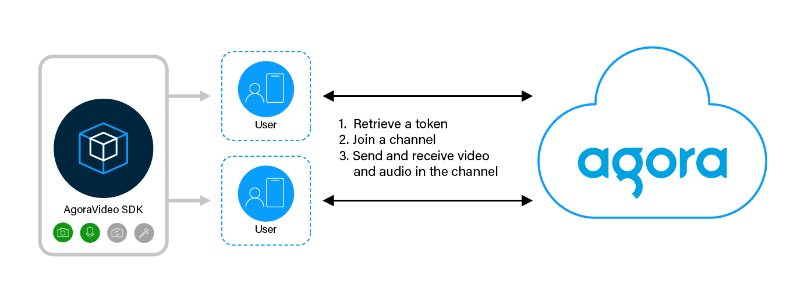

# SDK quickstart

Video Calling enables one-to-one or small-group video chat connections with smooth, jitter-free streaming video. Agora’s Video SDK makes it easy to embed real-time video chat into web, mobile, and native apps.

Thanks to Agora’s intelligent and global Software Defined Real-time Network ([Agora SD-RTN™](https://docs.agora.io/en/video-calling/overview/core-concepts#agora-sd-rtn)), you can rely on the highest available video and audio quality.

This page provides a sample project with best-practice code that illustrates the integration of high-quality, low-latency Video Calling features into an app using Video SDK.

## Understand the tech

This section explains how Video Calling works in an app. Best practice is to implement the following steps:

- *Set a token*: A token is a computer-generated string that authenticates a user when an app joins a channel. For testing purposes in this guide, you generate a temporary token from Agora Console. In a production environment, you need to create an authentication server and retrieve the token from it. See [Implement the authentication workflow](https://docs.agora.io/en/video-calling/develop/authentication-workflow) and [Token generators](https://docs.agora.io/en//video-calling/develop/integrate-token-generation) for details.

- *Join a channel*: Call methods to create an Agora Engine instance and join a channel. A token is generated for a single channel. The apps that pass tokens generated using the same app ID and channel name join the same channel.

- *Send and receive video and audio in the channel*: All users send and receive video and audio streams from all users in the channel.

## Reference

To view essential code snippets and their explanation, refer to the complete project documentation for your product of interest:

* [Video-calling](https://docs.agora.io/en/video-calling/get-started/get-started-sdk?platform=android)
* [Voice-Calling](https://docs.agora.io/en/voice-calling/get-started/get-started-sdk?platform=android)
* [Interactive live Streaming](https://docs.agora.io/en/interactive-live-streaming/get-started/get-started-sdk?platform=android)
* [Broadcast streaming](https://docs.agora.io/en/broadcast-streaming/get-started/get-started-sdk?platform=android)
